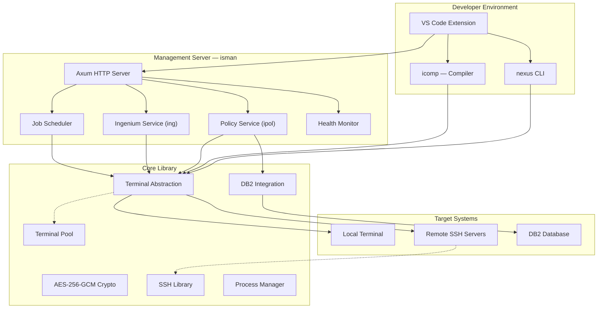

# 🏗️ Nexus Architecture

> **"A solid foundation does not merely bear today's load — it is ready for tomorrow's demands."**

---

## 🎯 Design Philosophy

Nexus architecture is built on **three core principles**:

| Principle | Practical Meaning |
|-----------|------------------|
| **Module Independence** | Each tool operates standalone — deploy incrementally, no all-or-nothing commitment |
| **Deployment Simplicity** | Single binary per tool, no runtime dependencies, no complex installation |
| **Cross-Platform Native** | Windows (Dev) and Linux (Production) — identical behavior, no surprises |

---

## 🧬 System Architecture

Nexus is a **Rust workspace** of 11 specialized crates sharing a common core library while maintaining clear separation of responsibility.



---

## 📦 Dependency Map

Every component builds on the **Core Library** — ensuring consistent behavior system-wide:

| Crate | Type | Function |
|-------|------|----------|
| **core** | Library | Foundation: terminal, DB2, crypto, parallel execution |
| **ssh** | Library | SSH connection management and pooling |
| **policy** | Library | Policy data models and business logic |
| **nexus** | Binary | CLI for environment orchestration |
| **icomp** | Binary | Intelligent COBOL compiler |
| **iman** | Binary | Ingenium management (CLI) |
| **ipol** | Binary | Policy management (CLI) |
| **isman** | Binary | Central HTTP management server |
| **benova** | Binary | Developer utilities |
| **vscext** | Extension | VS Code integration |

---

## 🔌 Terminal Abstraction Layer

This is **the most important architectural decision** in Nexus — a unified abstraction allowing every operation to run identically on a local machine or remote server via SSH.

```
               ┌──────────────────────┐
               │    Terminal Trait     │
               │  execute()           │
               │  read_all()          │
               │  change_directory()  │
               │  get_variable()      │
               └──┬───────────────┬───┘
                  │               │
          ┌───────▼────┐   ┌──────▼──────────┐
          │   Local    │   │  SSH Terminal    │
          │ Terminal   │   │  (Remote)        │
          └────────────┘   └─────────────────┘
```

**Practical Benefits:**

- **Write once, run anywhere** — code managing a local dev machine and a production server is identical
- **Terminal Pooling** — efficient connection reuse, preventing resource exhaustion
- **Configurable timeouts** — from quick queries (seconds) to long-running batch jobs (minutes)
- **Automatic health checks** — dead connections are transparently detected and replaced, zero disruption

---

## 🌐 Management Server Architecture

**isman** is built on Axum + Tokio — a high-performance async Rust stack handling thousands of concurrent requests with minimal resources.

```
Client Request
      │
      ▼
┌───────────┐     ┌──────────────┐     ┌────────────────┐
│  Router   │────▶│  Validation  │────▶│ spawn_blocking  │
│  (Axum)   │     │  (Params)    │     │   (Tokio)       │
└───────────┘     └──────────────┘     └───────┬────────┘
                                                │
                                       ┌────────▼───────┐
                                       │  Terminal Pool  │
                                       └────────┬───────┘
                                                │
                                       ┌────────▼───────┐
                                       │  DB2 / SSH Ops  │
                                       └────────────────┘
```

### API Endpoints

| Endpoint | Method | Function |
|----------|--------|----------|
| `/ping` | GET | Fast connectivity check |
| `/status` | GET | System health and uptime |
| `/ipol/tasks` | GET | List policy tasks |
| `/ipol/copy` | POST | Copy policy between environments |
| `/ipol/export` | POST | Export policy artifacts |
| `/ipol/import` | POST | Import policy artifacts |
| `/ipol/upload` | POST | Upload archive via HTTP |
| `/ipol/download` | GET | Download archive via HTTP |
| `/shutdown` | POST | Controlled server shutdown |

---

## 🗄️ DB2 Integration

- ✅ **Automatic connection management** — connect once, reuse, auto-close on cleanup
- ✅ **Secure credential handling** — decrypted in memory, zeroed immediately after use, never logged
- ✅ **SQL injection prevention** — built-in `sql_escape()` function and parameterized queries
- ✅ **Atomic operations** — supports `BEGIN ATOMIC ... END` for multi-statement transactions
- ✅ **Intelligent error detection** — SQLSTATE and SQL code analysis for precise error reporting

---

## 📐 Technology Stack

| Layer | Technology | Reason |
|-------|-----------|--------|
| Core language | Rust | High performance + memory safety + single binary |
| Async runtime | Tokio | Thousands of concurrent connections, zero overhead |
| HTTP framework | Axum | Fastest in Rust, type-safe routing |
| Encryption | AES-256-GCM | Military-grade, authentication built-in |
| SSH | libssh2 | Battle-tested, production-proven SSH library |
| Serialization | serde + serde_json | Zero-copy, maximum throughput |
| Compression | zstd | Best compression ratio available today |

---

## 📄 Legal Notice

This document is provided for informational and advisory purposes only. All trademarks are the property of their respective owners. This project has no affiliation with DXC Technology, Sun Life, or any other third parties mentioned herein.
