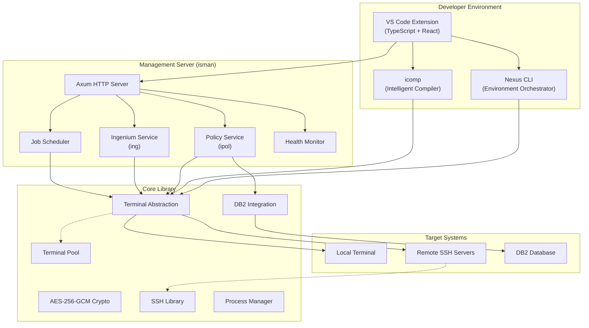

# 🏗️ Nexus Architecture

---

## 🎯 Design Philosophy

Nexus's architecture follows three guiding principles that set it apart from traditional DevOps tooling:

1. **Modular independence** — Each tool operates standalone, yet integrates seamlessly
2. **Zero-dependency deployment** — Single binary executables, no runtime environment needed
3. **Cross-platform by design** — Native support for both Windows (Dev) and Linux (Production)

This ensures that Nexus delivers value immediately upon deployment, with no complex setup or infrastructure changes required.

---

## 🧬 System Architecture

Nexus is structured as a **Rust workspace** — a unified codebase of 11 specialized crates (packages) that share a common core library while maintaining clear separation of concerns.



---

## 📦 Crate Dependency Map

Every component in Nexus builds upon the **Core Library**, ensuring consistent behavior across all tools:

| Crate | Type | Purpose | Key Dependencies |
|-------|------|---------|------------------|
| **core** | Library | Foundation: terminal, DB2, crypto, parallel execution | aes-gcm, tokio, serde |
| **ssh** | Library | SSH connection management and pooling | ssh2, core |
| **policy** | Library | Policy data models and business logic | core |
| **nexus** | Binary | Environment orchestrator CLI | core, ssh |
| **icomp** | Binary | Intelligent COBOL compiler | core |
| **iman** | Binary | Ingenium manager (CLI) | core |
| **ipol** | Binary | Policy manager (CLI) | core, policy |
| **isman** | Binary | Management HTTP server | core, ssh, policy, axum, tokio |
| **benova** | Binary | Developer utilities CLI | core |
| **vscext** | Extension | VS Code integration | TypeScript, webpack |

---

## 🔌 Terminal Abstraction Layer

One of Nexus's most powerful architectural decisions is the **unified Terminal trait** — an abstraction that allows every operation to run identically on local machines or remote servers via SSH.

```
               ┌────────────────────┐
               │   Terminal Trait    │
               │  execute()         │
               │  read_all()        │
               │  change_directory()│
               │  get_variable()    │
               └──┬──────────────┬──┘
                  │              │
          ┌───────▼───┐   ┌─────▼────────┐
          │   Local    │   │     SSH       │
          │ Terminal   │   │   Terminal    │
          └───────────┘   └──────────────┘
```

**Why this matters for enterprises:**

- **Write once, run anywhere** — The same code manages both local dev and remote production
- **Terminal pooling** — Reuses connections efficiently, preventing resource exhaustion
- **Configurable timeouts** — Operations automatically adapt from quick queries (seconds) to long-running batch jobs (minutes)
- **Automatic health checks** — Dead connections are detected and replaced transparently

---

## 🌐 Management Server Architecture

The **isman** management server is built on [Axum](https://github.com/tokio-rs/axum) — one of the fastest and most reliable Rust web frameworks — running on the [Tokio](https://tokio.rs/) async runtime.

### Request Flow

```
Client Request
      │
      ▼
┌───────────┐     ┌──────────────┐     ┌───────────────┐
│  Router   │────▶│  Validation  │────▶│ spawn_blocking │
│  (Axum)   │     │  (IpolParam) │     │   (Tokio)      │
└───────────┘     └──────────────┘     └───────┬───────┘
                                                │
                                         ┌──────▼──────┐
                                         │  Terminal    │
                                         │  Pool        │
                                         └──────┬──────┘
                                                │
                                         ┌──────▼──────┐
                                         │  DB2 / SSH   │
                                         │  Operations  │
                                         └─────────────┘
```

### Key Design Features

- **Non-blocking architecture** — Blocking I/O operations (DB2 queries, file access, SSH commands) are offloaded to dedicated thread pools via `spawn_blocking`, ensuring the async event loop remains responsive
- **Input validation** — All incoming parameters are validated before processing, preventing injection attacks and path traversal
- **Graceful shutdown** — Broadcast-based shutdown mechanism ensures all in-flight operations complete cleanly
- **Job scheduling** — Background scheduler manages recurring tasks with configurable thread pools
- **Health monitoring** — Built-in `/status` endpoint provides real-time uptime and system health

### API Endpoints

| Endpoint | Method | Function |
|----------|--------|----------|
| `/ping` | GET | Connectivity check |
| `/status` | GET | System health & uptime |
| `/ipol/tasks` | GET | List policy tasks |
| `/ipol/copy` | POST | Copy policy between environments |
| `/ipol/export` | POST | Export policy artifacts |
| `/ipol/import` | POST | Import policy artifacts |
| `/ipol/download` | GET | Download policy archive |
| `/ipol/upload` | POST | Upload policy archive |
| `/shutdown` | POST | Graceful server shutdown |

---

## 🗄️ DB2 Integration

Nexus provides a **type-safe, injection-resistant** DB2 integration layer that works seamlessly across local and remote environments:

- **Automatic connection management** — Connect once, reuse across operations, auto-disconnect on cleanup
- **Secure credential handling** — Passwords are decrypted in memory, set as environment variables briefly for authentication, then immediately cleared with verification
- **SQL injection prevention** — Built-in `sql_escape()` function and parameterized queries
- **Atomic operations** — Support for atomic multi-statement transactions via `BEGIN ATOMIC ... END`
- **Error detection** — Intelligent SQLSTATE and SQL code parsing to detect and report database errors

---

## 🔄 Parallel Execution Engine

For operations that must run across multiple servers or environments simultaneously, Nexus provides a **parallel execution framework**:

- Execute the same operation across N targets concurrently
- Configurable concurrency limits to prevent resource saturation
- Aggregated results with per-target error reporting
- Thread-safe terminal pool management

---

## 📐 Technology Stack

| Layer | Technology | Rationale |
|-------|-----------|-----------|
| **Language** | Rust 2021 | Performance, safety, zero-cost abstractions |
| **Async Runtime** | Tokio | Industry-standard async runtime for Rust |
| **HTTP Framework** | Axum 0.7 | Type-safe, ergonomic, high-performance |
| **Encryption** | AES-256-GCM | Military-grade authenticated encryption |
| **SSH** | libssh2 | Battle-tested SSH protocol implementation |
| **Serialization** | Serde + TOML | Human-readable configuration, type-safe parsing |
| **CLI** | Clap | Robust argument parsing with auto-generated help |
| **Extension** | TypeScript + Webpack | Modern VS Code extension development |

---

## 📄 Legal Disclaimer

This document is provided for reference and consulting purposes regarding system integration and transformation solutions.  
All trademarks, product names, and company names mentioned herein are the property of their respective owners.  
This project is not affiliated with, sponsored by, or endorsed by DXC Technology, Sun Life, or any other third party mentioned.
