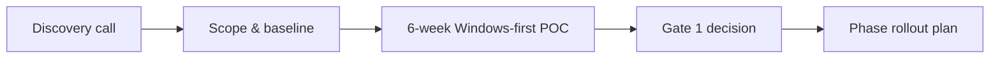
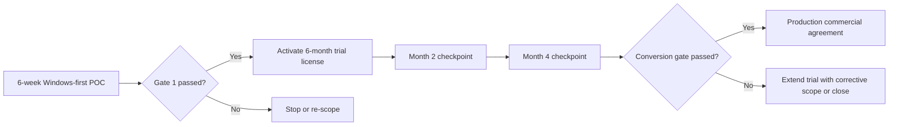

# Commercial Decision Guide

## Purpose

This page helps executive sponsors and finance/operations stakeholders decide how to buy Nova with controlled risk.

## Buying options

| Option | Best when | What you commit now | Decision output |
|---|---|---|---|
| 6-week Windows-first POC | You need fast proof and executive hands-on visibility | Limited scope, clear KPI baseline, executive sponsor | Go/no-go decision with evidence + 6-month trial activation |
| Phase rollout (Nexus first) | POC value is proven and speed is the top priority | One application area and delivery cadence | Measurable cycle-time and reliability improvement |
| Multi-phase modernization | You want broader economics (cost + speed + integration) | Sequenced roadmap and governance model | 12-24 month transformation plan |

## Budget logic for executives

- Phase funding by evidence, not by long-range assumptions
- Cap downside risk at each decision gate
- Expand only when KPI and governance confidence are proven

## Commercial principles

- No big-bang lock-in commitment upfront
- Existing Ingenium logic and IP remain under your ownership
- Commercial model can be structured as fixed-scope milestones or time-and-material, based on procurement preference
- Scope-based milestones tied to decision gates
- Transparent assumptions for cost, timeline, and dependencies

## What to align before approval

1. Priority Ingenium flow for the first scope
2. Baseline metrics (current build/deploy time, manual effort, rollback rate)
3. Sponsor group (technology sponsor, business owner, finance delegate)
4. Gate criteria for phase expansion

## Decision timeline (typical)

## Trial-to-production conversion path

### Conversion gate criteria

1. KPI trend remains positive versus baseline (cycle time, reliability, manual effort)
2. Governance controls are operating (traceability, risk log, owner accountability)
3. Commercial scope, ownership model, and rollout plan are approved

## Executive takeaway

Nova is purchased as a controlled modernization sequence, not as a single all-or-nothing programme.

---

📧 [Discuss commercial options](mailto:ingenium.modernization@gmail.com?subject=Nova%20Commercial%20Discussion&body=Name:%0ACompany:%0ARole:%0APriority%20outcome:%0A)