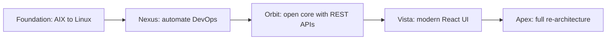
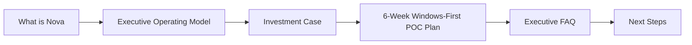

# What is Nova?

**Nova modernizes the Ingenium life-insurance core — the legacy COBOL platform running on AIX, IBM MQ and WebSphere that still powers policy administration at many insurers.**

Instead of a risky "rip and replace", Nova wraps around your existing Ingenium system and upgrades it in stages. You keep your business logic and data; Nova modernizes the technology around it.

> Nova is a third-party solution. It integrates with and modernizes Ingenium — it does **not** replace your Ingenium licence or modify its source. You retain full ownership.

## The problem Nova solves

If you run Ingenium today, you likely face:

- **Slow releases** — COBOL builds and deployments take hours and are done manually.
- **High, rising cost** — proprietary AIX, IBM MQ and WebSphere are expensive, and COBOL specialists are increasingly hard to hire.
- **A closed core** — no REST APIs, so every digital channel or partner integration needs fragile middleware.
- **Operational risk** — manual environment setup drifts over time, causing "works here, fails there" incidents and audit gaps.

These are not just IT issues — they slow product launches, raise cost-to-serve, and limit growth.

## How Nova works: a phased roadmap

Each phase delivers value on its own. You start small, see results, then decide how far to go.

| Phase | Status | What it delivers |
|---|---|---|
| **Foundation** | Prerequisite (proven, ~9 months) | Move Ingenium from AIX to Linux (cloud or on-prem). The base for everything else. |
| **Nexus** | Available now | VS Code toolchain that automates COBOL builds, deployments and environments. Hours become minutes; COBOL becomes AI-assisted. |
| **Orbit** | In development | Expose Ingenium as REST APIs, remove MQ middleware, and migrate critical logic to high-performance Rust. |
| **Vista** | Planned | Replace legacy JSP screens with modern React interfaces for customers and agents. |
| **Apex** | Planned | Full re-architecture of business logic and data into a cloud-native platform. |

## Why it is credible

Nova is proven in production from a **real AIX-to-Linux migration completed in ~9 months**, where deployment time for a representative change moved from around **3 hours to about 20 minutes** with an expected **~5-minute planned downtime window** per deployment. The roadmap above is the same sequence used in that programme.

## Where to start

### Information map

1. [Executive Operating Model](/docs/operating_model) — pain points, solution mapping, and decision gates
2. [Investment Case](/docs/investment_case) — the business justification and numbers
3. [6-Week Windows-First POC Plan](/docs/poc_plan) — fast executive visibility, low-risk proof, and 6-month trial continuation
4. [Executive FAQ](/docs/executive_faq) — direct answers to common leadership questions
5. [Next Steps](/docs/next_steps) — book a 30-minute, no-obligation discovery call

📧 Questions? [ingenium.modernization@gmail.com](mailto:ingenium.modernization@gmail.com?subject=Nova%20Inquiry)

