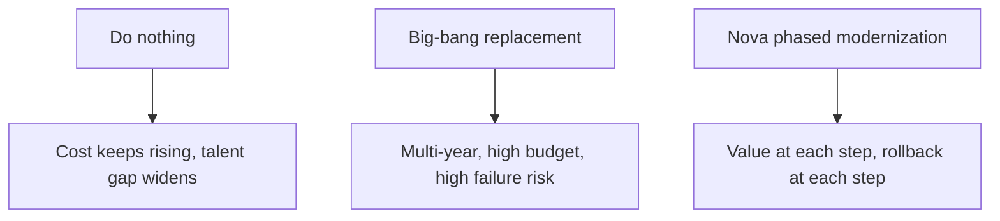

# Investment Case

## Executive summary

Nova modernizes your Ingenium insurance core in stages — without a big-bang replacement. It is proven in production from a **real AIX-to-Linux migration completed in ~9 months** that reduced deployment time for a representative change from around **3 hours to about 20 minutes**.

You start with a scoped POC on your own system, confirm the numbers, then decide how far to scale. Low risk in, measurable value out.

📧 **Ready to discuss your situation?** [ingenium.modernization@gmail.com](mailto:ingenium.modernization@gmail.com?subject=Nova%20Investment%20Discussion)

## Project at a glance

| Leadership needs to know | Nova position |
|---|---|
| What it is | A third-party platform that modernizes Ingenium (COBOL/AIX). It keeps your logic, data and licence. |
| Program type | Phased modernization, not big-bang replacement |
| Where it stands | Foundation (AIX→Linux) proven; Nexus available now; Orbit in development; Vista/Apex planned |
| How you adopt it | POC-first, on your own system, with clear decision gates |
| Deployment | Cloud, on-premise, or hybrid — your choice |
| Commercial | You retain full IP ownership; no vendor lock-in |

## The cost of standing still

| Legacy pain today | Business impact |
|---|---|
| Hour-long COBOL builds & manual deploys | Slow product launches, engineer time wasted |
| AIX / IBM MQ / WebSphere licences | High fixed run-cost that rises each year |
| Shrinking COBOL talent pool | Key-person risk and rising salaries |
| No REST APIs | Every channel/partner integration is slow and fragile |

## What the investment buys

| Executive objective | Concrete Nova change |
|---|---|
| Faster product launches | Automated COBOL builds and one-click deployment (~3 hours → ~20 minutes) |
| Lower run-cost | Move off AIX/MQ/WebSphere to open Linux and reduce long-term legacy platform dependency |
| Digital & partner growth | REST APIs expose the core without MQ middleware |
| Reduced operational risk | Consistent, automated environments and controlled deployment windows (~5 minutes planned downtime per release) |

## Why phased beats the alternatives

## Investment decision gate

Proceed to the next phase only if the POC confirms, on your own system:

1. A measurable improvement in build/deploy time for a real change
2. Reduced manual effort and environment risk
3. A credible 12–24 month economic case versus staying on legacy

---

## Next step

Start with a scoped POC on one of your own Ingenium flows.

📧 [Schedule a 30-minute discovery call](mailto:ingenium.modernization@gmail.com?subject=Nova%20Discovery%20Call%20Request&body=Name:%0ACompany:%0ARole:%0APreferred%20date/time:%0ABrief%20context:)  
⏱️ Typical response within 2 business days  
🎯 No-obligation — an honest assessment of whether Nova fits your situation

