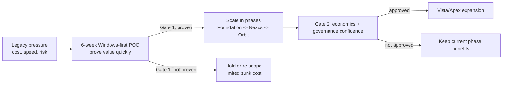

# Executive Operating Model: Pain Points to Decision

## Why this page exists

Most insurance-core modernization proposals are either too technical or too vague.

This page gives a simple decision model for executives:

1. Where value is being lost today
2. How Nova addresses that loss in phases
3. What decision to make at each gate

## 1) Current-state pressure points

| What executive teams face today | Business consequence |
|---|---|
| Hour-long COBOL build/deploy cycles | Slow product launches and weak response to market shifts |
| Rising AIX / MQ / WebSphere run-cost | Margin pressure and budget trapped in maintenance |
| Manual release and environment steps | Higher outage and audit risk |
| Closed core with limited APIs | Slow partner onboarding and digital channel delay |
| Shrinking legacy talent pool | Delivery bottlenecks and key-person dependency |

## 2) General modernization model

## 3) Pain-to-solution mapping

| Pain point | Nova response | KPI signal |
|---|---|---|
| Slow change cycles | Nexus automation for COBOL build/deploy | Time from approved change to deployed build |
| High legacy run-cost | Foundation path from AIX to Linux | Infrastructure run-cost trend |
| Integration bottlenecks | Orbit REST API exposure of core functions | Time to onboard channel/partner integration |
| Operational inconsistency | Standardized environments and release traceability | Rollback rate and audit completeness |

## 4) Decision gates for executives

### Gate 1 (after 6-week Windows-first POC)

Approve scale only if all are true:

1. Build/deploy cycle time improves on a real change in your own environment
2. Manual effort and release risk reduce with evidence
3. Scope, governance, and budget for the next phase are clear

### Gate 2 (after scale phase)

Expand to next phase only if all are true:

1. Economics remain better than staying on legacy
2. Governance confidence is strong (auditability, rollback readiness, ownership)
3. Business sponsors confirm impact on growth, cost, or resilience

## 5) What this means commercially

- Not a big-bang replacement commitment
- Funding can be phased by evidence
- Risk is capped at each gate
- Existing Ingenium logic and IP stay under your control

---

## Recommended next step

Run a 6-week, evidence-first Windows POC on one high-friction Ingenium flow, then continue under the 6-month trial license if Gate 1 passes.

📧 [Schedule a discovery call](mailto:ingenium.modernization@gmail.com?subject=Nova%20Operating%20Model%20Discussion&body=Name:%0ACompany:%0ARole:%0APriority%20flow:%0AKey%20pain%20today:)