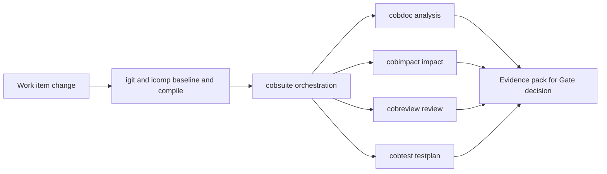
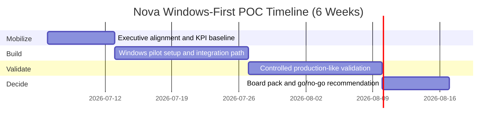

# 6-Week Windows-First POC Plan

## POC objective

Give executive leadership a fast, hands-on view in a **Windows-only POC environment**: run one representative COBOL change and show clear before/after evidence for cycle time, delivery control, and AI-assisted workflow quality.

This follows the same approach used in the reference ~9-month Ingenium migration.

📧 [Discuss your POC scope](mailto:ingenium.modernization@gmail.com?subject=Nova%20POC%20Scope%20Discussion)

## What we set up in the POC

- **Windows-only pilot setup** for executive visibility and safe evaluation
- **Nexus toolchain** in VS Code for one Ingenium application area
- **Automated COBOL build & deploy** for a representative change
- **One consistent, repeatable environment** (removing manual setup drift)
- Optional: **one REST API endpoint** exposing an existing Ingenium function

## Trial license packaged with the POC

- A **6-month trial license** is included after the 6-week POC to extend hands-on usage beyond the pilot.
- Recommended governance model: checkpoint reviews at month 2 and month 4, then convert to production commercial terms only if KPI and governance gates are met.

## AI enablement included in the POC package

This POC includes a practical AI working model based on the real Ingenium project setup in `.github/agents` and `.github/skills`.

Skill and agent inventory is managed as a living operating model. The list below is the **current baseline at POC kickoff** and can change over time based on tool maturity, governance requirements, and delivery scope.

### 1) Nexus skills baseline at POC kickoff

| Skill | What it does in POC |
|---|---|
| `icomp` | COBOL compile workflows (`quick`, `mass`, `golden`, `bind`) for faster change cycles |
| `igit` | Work-item Git flow and source-point delta (`info`, `diff`, `list`, `golden`) |
| `ing` | Worker lifecycle control by region (`start`, `stop`, `status`) |
| `iadm` | DB2 administration operations for controlled environment setup |
| `idb` | Backup/restore runs to protect rollback and recovery confidence |
| `nexus` | Security utilities (`encrypt`, `decrypt`, `hash`, `lic`) for safe operational handling |

### 2) Specialized agents baseline at POC kickoff

| Agent | POC role | Persistent output |
|---|---|---|
| `cobdoc` | Technical analysis of work-item change | `<WORK-ITEM-ID>_analysis.md` |
| `cobimpact` | Impact matrix and regression scope tiers | `<WORK-ITEM-ID>_impact.md` |
| `cobreview` | Risk-first review with prioritized findings | `<WORK-ITEM-ID>_review.md` |
| `cobtest` | Requirement-to-test traceability and blockers | `<WORK-ITEM-ID>_testplan.md` |
| `cobsuite` | Orchestrates full pipeline across agents | Consolidated artifact set in `doc/items/<branch>/` |

### 3) Why this matters for executive decisions

- AI support is tied to real delivery operations, not chat-only assistance.
- Each agent creates persistent, auditable evidence files for governance reviews.
- Go/no-go decisions at the end of POC are based on measurable output quality, cycle time, and risk visibility.

### 4) AI workflow used during POC

## Execution blueprint

## Success metrics

| KPI | What we measure |
|---|---|
| Build & deploy time | Time from an approved COBOL change to a deployed, running build (before vs after) |
| Reliability | Failed/rolled-back deployments and environment inconsistencies |
| Manual effort | Engineer hours spent on build/deploy/environment setup |
| Auditability | Whether every release and environment change is traceable |
| AI evidence quality | Completeness and usability of generated `_analysis`, `_impact`, `_review`, `_testplan` artifacts for one real work item |
| Trial adoption readiness | Whether teams can continue with the included 6-month trial under agreed governance checkpoints |

## Governance cadence

- Weekly steering checkpoint with executive sponsor delegate and business owner
- Bi-weekly risk and dependency review
- End-of-POC evidence review with the transformation office / CFO delegate

## Exit criteria

1. The build/deploy time improvement is clear and attributable
2. Risks are documented with mitigation path and residual impact
3. Leadership receives a prioritized, costed scale-out roadmap
4. Windows-first pilot is approved to continue under the 6-month trial license model

---

## Ready to define your POC?

📧 [Schedule discovery call](mailto:ingenium.modernization@gmail.com?subject=Nova%20POC%20Planning&body=Name:%0ACompany:%0ARole:%0APriority%20Ingenium%20area:)  
⏱️ Response within 2 business days  
🎯 No-obligation consultation
