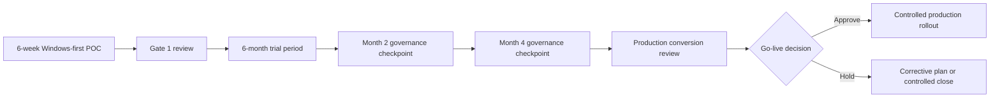

# Risk and Governance Position

## Why executives ask this first

Modernization only gets approved when risk is visible, controlled, and reversible.

## Risk controls built into the approach

| Risk concern | Nova control |
|---|---|
| Transformation shock | Phased rollout with go/no-go gates |
| Operational disruption | POC on a bounded scope before scale |
| Release failure | Automated and repeatable build/deploy process |
| Audit gaps | Traceable change and release records |
| Vendor dependency | Existing Ingenium logic and IP remain yours |

## Governance model

- Weekly steering checkpoint with executive sponsor delegate and business owner
- Bi-weekly risk and dependency review
- End-of-phase evidence review before each expansion decision

## Decision gates and stop conditions

### Gate 1 (post-POC)

Proceed only if KPI improvement is proven on your own environment.

### Gate 2 (post-scale phase)

Proceed only if economics and governance confidence remain stronger than the legacy path.

### Trial-to-production governance flow

### Stop conditions

- KPI benefit is not attributable
- Dependency risk is unresolved
- Ownership or governance confidence is not sufficient

## Data, ownership, and accountability

- Nova is a third-party modernization layer for Ingenium
- Your business logic, data, and IP ownership stay with your organization
- Executive sponsors retain decision control at every gate

## Executive takeaway

This is a risk-managed modernization model with explicit controls, not a blind technology replacement.

---

📧 [Request a risk-and-governance walkthrough](mailto:ingenium.modernization@gmail.com?subject=Nova%20Risk%20Governance%20Review&body=Name:%0ACompany:%0ARole:%0APrimary%20risk%20concern:%0A)