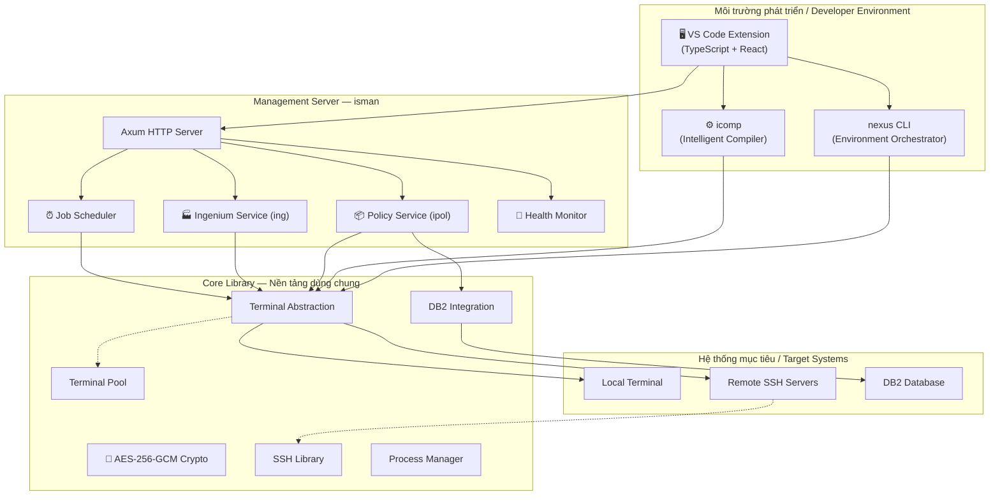

# 🏗️ Kiến Trúc Nexus / Nexus Architecture

> **"Một nền tảng vững chắc không chỉ chịu được trọng lượng hiện tại — nó còn sẵn sàng cho tương lai."**
>
> *"A solid foundation doesn't just bear today's load — it's ready for tomorrow's ambitions."*

---

## 🎯 Triết Lý Thiết Kế / Design Philosophy

Kiến trúc Nexus được xây dựng trên **ba nguyên tắc bất di bất dịch** — không phải lý thuyết, mà là cam kết kỹ thuật được hiện thực hóa trong từng dòng code:

*Nexus architecture is built on three uncompromising principles — not theory, but technical commitments realized in every line of code:*

| Nguyên tắc | *Principle* | Ý nghĩa thực tiễn |
|---|---|---|
| **Độc lập mô-đun** | *Modular Independence* | Mỗi công cụ hoạt động standalone — triển khai từng phần, không all-or-nothing |
| **Triển khai zero-dependency** | *Zero-Dependency Deployment* | Một file binary duy nhất, không cần runtime, không cần cài đặt phức tạp |
| **Đa nền tảng nguyên bản** | *Cross-Platform by Design* | Windows (Dev) và Linux (Production) — hành vi giống hệt nhau, không bất ngờ |

---

## 🧬 Kiến Trúc Hệ Thống / System Architecture

Nexus là một **Rust workspace** — 11 crate chuyên biệt chia sẻ thư viện lõi nhưng duy trì ranh giới trách nhiệm rõ ràng.

*Nexus is a Rust workspace — 11 specialized crates sharing a common core library while maintaining clear separation of concerns.*



---

## 📦 Bản Đồ Phụ Thuộc / Crate Dependency Map

Mọi thành phần đều xây dựng trên **Core Library** — đảm bảo hành vi nhất quán trên toàn hệ thống:

*Every component builds upon the Core Library — ensuring consistent behavior across all tools:*

| Crate | Loại | Chức năng | *Purpose* |
|-------|------|-----------|-----------|
| **core** | Library | Nền tảng: terminal, DB2, crypto, parallel execution | Foundation layer |
| **ssh** | Library | Quản lý kết nối SSH, pooling | SSH connection management |
| **policy** | Library | Mô hình dữ liệu policy, nghiệp vụ | Policy models and logic |
| **nexus** | Binary | CLI điều phối môi trường | Environment orchestrator |
| **icomp** | Binary | Trình biên dịch COBOL thông minh | Intelligent COBOL compiler |
| **iman** | Binary | Quản lý Ingenium (CLI) | Ingenium manager |
| **ipol** | Binary | Quản lý Policy (CLI) | Policy manager |
| **isman** | Binary | HTTP server quản lý | Management HTTP server |
| **benova** | Binary | Tiện ích lập trình viên | Developer utilities |
| **vscext** | Extension | Tích hợp VS Code | VS Code integration |

---

## 🔌 Tầng Trừu Tượng Terminal / Terminal Abstraction Layer

Đây là **quyết định kiến trúc quan trọng nhất** của Nexus — một abstraction thống nhất cho phép mọi thao tác chạy giống hệt nhau trên máy local hoặc remote server qua SSH.

*One of Nexus's most powerful decisions: a unified Terminal abstraction that allows every operation to run identically on local machines or remote servers via SSH.*

```
               ┌──────────────────────┐
               │    Terminal Trait     │
               │  execute()           │
               │  read_all()          │
               │  change_directory()  │
               │  get_variable()      │
               └──┬───────────────┬───┘
                  │               │
          ┌───────▼────┐   ┌──────▼────────┐
          │   Local    │   │  SSH Terminal  │
          │ Terminal   │   │  (Remote)      │
          └────────────┘   └───────────────┘
```

**Tại sao điều này quan trọng với doanh nghiệp bạn:**
*Why this matters for your enterprise:*

- 🔁 **Viết một lần, chạy mọi nơi** — *Write once, run anywhere* — Code quản lý dev local và production server là như nhau
- ♻️ **Terminal Pooling** — Tái sử dụng kết nối hiệu quả, ngăn resource exhaustion
- ⏱️ **Timeout có thể cấu hình** — Từ query nhanh (giây) đến batch job dài (phút)
- 💓 **Health check tự động** — Kết nối chết được phát hiện và thay thế trong suốt

---

## 🌐 Kiến Trúc Management Server / Management Server Architecture

**isman** được xây dựng trên [Axum](https://github.com/tokio-rs/axum) + [Tokio](https://tokio.rs/) — stack async Rust hàng đầu, xử lý hàng nghìn request đồng thời với tài nguyên tối thiểu.

*isman is built on Axum + Tokio — Rust's premier async web stack, handling thousands of concurrent requests with minimal resources.*

### Luồng xử lý Request / Request Flow

```
Client Request
      │
      ▼
┌───────────┐     ┌──────────────┐     ┌────────────────┐
│  Router   │────▶│  Validation  │────▶│ spawn_blocking  │
│  (Axum)   │     │  (Params)    │     │   (Tokio)       │
└───────────┘     └──────────────┘     └───────┬────────┘
                                                │
                                       ┌────────▼───────┐
                                       │  Terminal Pool  │
                                       └────────┬───────┘
                                                │
                                       ┌────────▼───────┐
                                       │  DB2 / SSH Ops  │
                                       └────────────────┘
```

### API Endpoints

| Endpoint | Method | Chức năng | *Function* |
|----------|--------|-----------|------------|
| `/ping` | GET | Kiểm tra kết nối | Connectivity check |
| `/status` | GET | Sức khỏe hệ thống & uptime | Health & uptime |
| `/ipol/tasks` | GET | Danh sách policy task | List policy tasks |
| `/ipol/copy` | POST | Sao chép policy | Copy policy |
| `/ipol/export` | POST | Xuất policy artifacts | Export artifacts |
| `/ipol/import` | POST | Nhập policy artifacts | Import artifacts |
| `/ipol/upload` | POST | Tải lên qua HTTP | Upload archive |
| `/ipol/download` | GET | Tải xuống qua HTTP | Download archive |
| `/shutdown` | POST | Tắt server có kiểm soát | Graceful shutdown |

---

## 🗄️ Tích hợp DB2 / DB2 Integration

Nexus cung cấp lớp tích hợp DB2 **type-safe và injection-resistant**:

*Nexus provides a type-safe, injection-resistant DB2 integration layer:*

- ✅ **Quản lý kết nối tự động** — Kết nối một lần, tái sử dụng, tự ngắt khi dọn dẹp
- ✅ **Xử lý credential an toàn** — Giải mã trong memory, dùng xong xóa ngay, không bao giờ log
- ✅ **Ngăn SQL injection** — Hàm `sql_escape()` tích hợp và parameterized queries
- ✅ **Thao tác nguyên tử** — Hỗ trợ `BEGIN ATOMIC ... END` cho multi-statement transactions
- ✅ **Phát hiện lỗi thông minh** — Phân tích SQLSTATE và SQL code để báo lỗi chính xác

---

## 🔄 Engine Thực Thi Song Song / Parallel Execution Engine

Với các thao tác cần chạy đồng thời trên nhiều server:

*For operations that must run across multiple servers simultaneously:*

- Thực thi cùng thao tác trên N target đồng thời
- Giới hạn concurrency có thể cấu hình — ngăn resource saturation
- Kết quả tổng hợp với báo cáo lỗi theo từng target
- Terminal pool quản lý thread-safe

---

## 📐 Stack Công Nghệ / Technology Stack

| Tầng | *Layer* | Công nghệ | Lý do chọn |
|------|---------|-----------|------------|
| Ngôn ngữ chính | *Language* | Rust | Hiệu năng + An toàn bộ nhớ + Binary đơn lẻ |
| Async Runtime | *Runtime* | Tokio | Hàng nghìn connection đồng thời, zero overhead |
| HTTP Framework | *Web* | Axum | Rust nhanh nhất, type-safe routing |
| Mã hóa | *Encryption* | AES-256-GCM (aes-gcm) | Tiêu chuẩn quân sự, xác thực tích hợp |
| SSH | *SSH* | libssh2 | Thư viện SSH battle-tested |
| Serialization | *Serialization* | serde + serde_json | Zero-copy, cực nhanh |
| Compression | *Compression* | zstd | Nén tốt nhất có trong giới |

---

## 📄 Tuyên bố pháp lý / Legal Disclaimer

Tài liệu này được cung cấp cho mục đích tham khảo và tư vấn. Mọi thương hiệu thuộc sở hữu của chủ tương ứng. Dự án không liên kết với DXC Technology, Sun Life hay bất kỳ bên thứ ba nào được đề cập.

*This document is for reference and consulting purposes. All trademarks belong to their respective owners. This project is not affiliated with DXC Technology, Sun Life, or any third party mentioned.*
