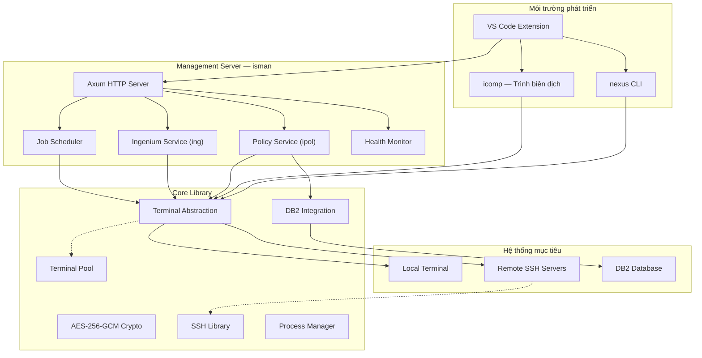

# 🏗️ Kiến Trúc Nexus

> **"Một nền tảng vững chắc không chỉ chịu được trọng lượng hiện tại — nó còn sẵn sàng cho tương lai."**

---

## 🎯 Triết Lý Thiết Kế

Kiến trúc Nexus được xây dựng trên **ba nguyên tắc cốt lõi**:

| Nguyên tắc | Ý nghĩa thực tiễn |
|---|---|
| **Độc lập mô-đun** | Mỗi công cụ hoạt động độc lập — có thể triển khai từng phần, không cần all-or-nothing |
| **Triển khai không phụ thuộc** | Một file binary duy nhất, không cần runtime, không cần cài đặt phức tạp |
| **Đa nền tảng nguyên bản** | Windows (Dev) và Linux (Production) — hành vi giống hệt nhau, không có bất ngờ |

---

## 🧬 Kiến Trúc Hệ Thống

Nexus là một **Rust workspace** — 11 crate chuyên biệt chia sẻ thư viện lõi nhưng duy trì ranh giới trách nhiệm rõ ràng.



---

## 📦 Bản Đồ Phụ Thuộc

Mọi thành phần đều xây dựng trên **Core Library** — đảm bảo hành vi nhất quán trên toàn hệ thống:

| Crate | Loại | Chức năng |
|-------|------|-----------|
| **core** | Library | Nền tảng: terminal, DB2, crypto, parallel execution |
| **ssh** | Library | Quản lý kết nối SSH, connection pooling |
| **policy** | Library | Mô hình dữ liệu policy và nghiệp vụ |
| **nexus** | Binary | CLI điều phối môi trường |
| **icomp** | Binary | Trình biên dịch COBOL thông minh |
| **iman** | Binary | Quản lý Ingenium (CLI) |
| **ipol** | Binary | Quản lý Policy (CLI) |
| **isman** | Binary | HTTP server quản lý trung tâm |
| **benova** | Binary | Tiện ích lập trình viên |
| **vscext** | Extension | Tích hợp VS Code |

---

## 🔌 Tầng Trừu Tượng Terminal

Đây là **quyết định kiến trúc quan trọng nhất** của Nexus — một abstraction thống nhất cho phép mọi thao tác chạy giống hệt nhau trên máy local hoặc remote server qua SSH.

```
               ┌──────────────────────┐
               │    Terminal Trait     │
               │  execute()           │
               │  read_all()          │
               │  change_directory()  │
               │  get_variable()      │
               └──┬───────────────┬───┘
                  │               │
          ┌───────▼────┐   ┌──────▼──────────┐
          │   Local    │   │  SSH Terminal    │
          │ Terminal   │   │  (Remote)        │
          └────────────┘   └─────────────────┘
```

**Lợi ích thực tế:**

- **Viết một lần, chạy mọi nơi** — Code quản lý máy dev local và server production là như nhau
- **Terminal Pooling** — Tái sử dụng kết nối hiệu quả, ngăn resource exhaustion
- **Timeout cấu hình được** — Từ query nhanh (giây) đến batch job dài hàng phút
- **Health check tự động** — Kết nối chết được phát hiện và thay thế trong suốt, không gián đoạn

---

## 🌐 Kiến Trúc Management Server

**isman** được xây dựng trên Axum + Tokio — stack async Rust hiệu năng cao, xử lý hàng nghìn request đồng thời với tài nguyên tối thiểu.

```
Client Request
      │
      ▼
┌───────────┐     ┌──────────────┐     ┌────────────────┐
│  Router   │────▶│  Validation  │────▶│ spawn_blocking  │
│  (Axum)   │     │  (Params)    │     │   (Tokio)       │
└───────────┘     └──────────────┘     └───────┬────────┘
                                                │
                                       ┌────────▼───────┐
                                       │  Terminal Pool  │
                                       └────────┬───────┘
                                                │
                                       ┌────────▼───────┐
                                       │  DB2 / SSH Ops  │
                                       └────────────────┘
```

### API Endpoints

| Endpoint | Method | Chức năng |
|----------|--------|-----------|
| `/ping` | GET | Kiểm tra kết nối nhanh |
| `/status` | GET | Sức khỏe hệ thống & uptime |
| `/ipol/tasks` | GET | Danh sách policy task |
| `/ipol/copy` | POST | Sao chép policy giữa các môi trường |
| `/ipol/export` | POST | Xuất policy artifacts |
| `/ipol/import` | POST | Nhập policy artifacts |
| `/ipol/upload` | POST | Tải archive lên qua HTTP |
| `/ipol/download` | GET | Tải archive xuống qua HTTP |
| `/shutdown` | POST | Tắt server có kiểm soát |

---

## 🗄️ Tích Hợp DB2

- ✅ **Quản lý kết nối tự động** — Kết nối một lần, tái sử dụng, tự ngắt khi dọn dẹp
- ✅ **Xử lý credential an toàn** — Giải mã trong memory, dùng xong xóa ngay, không bao giờ ghi log
- ✅ **Ngăn SQL injection** — Hàm `sql_escape()` tích hợp và parameterized queries
- ✅ **Thao tác nguyên tử** — Hỗ trợ `BEGIN ATOMIC ... END` cho multi-statement transactions
- ✅ **Phát hiện lỗi thông minh** — Phân tích SQLSTATE và SQL code để báo lỗi chính xác

---

## 📐 Stack Công Nghệ

| Tầng | Công nghệ | Lý do lựa chọn |
|------|-----------|----------------|
| Ngôn ngữ chính | Rust | Hiệu năng cao + an toàn bộ nhớ + binary đơn lẻ |
| Async Runtime | Tokio | Xử lý hàng nghìn kết nối đồng thời, zero overhead |
| HTTP Framework | Axum | Nhanh nhất trong Rust, routing type-safe |
| Mã hóa | AES-256-GCM | Tiêu chuẩn quân sự, tích hợp xác thực |
| SSH | libssh2 | Thư viện SSH đã được kiểm chứng thực tế |
| Serialization | serde + serde_json | Zero-copy, hiệu năng cực cao |
| Compression | zstd | Tỉ lệ nén tối ưu nhất hiện nay |

---

## 📄 Tuyên Bố Pháp Lý

Tài liệu này được cung cấp cho mục đích tham khảo và tư vấn. Mọi thương hiệu thuộc sở hữu của chủ tương ứng. Dự án không liên kết với DXC Technology, Sun Life hay bất kỳ bên thứ ba nào được đề cập.
